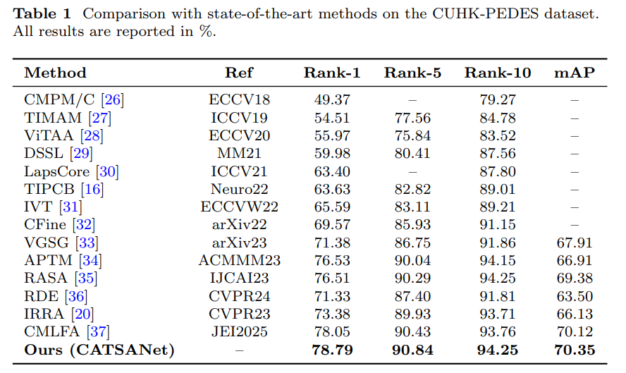
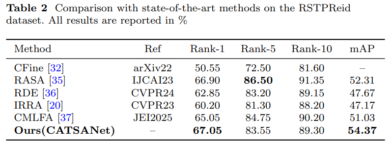

# CATSANet: Cross-Modal Semantic Token Selection and Optimal Transport based Part Alignment for Text-to-Image Person ReID

Official PyTorch implementation of the paper Cross-Modal Semantic Token Selection and Optimal Transport based Part Alignment for Text-to-Image Person ReID. 


## Highlights

We propose a Cross-Modal Semantic Token Selection and Alignment Network (CATSANet) that improves text-to-image person ReID by filtering identity-irrelevant visual tokens and enforcing fine-grained part alignment. Specifically, CATSANet contains three key components: (1) a cross-image semantic consistency-driven token selection module that suppresses noisy patches, (2) an Optimal Transport-based Part-Alignment Contrastive Loss (PACL) that performs soft, globally consistent alignment of modality-specific prototypes, and (3) a post-alignment residual interaction fusion module that adaptively integrates aligned local cues with global features to reduce representation gaps. Extensive experiments on CUHK-PEDES and RSTPReid show that CATSANet achieves competitive Rank-k and mAP performance while delivering more reliable fine-grained alignment and ranking quality across datasets.


## Usage
### Requirements
we use single RTX3090 24G GPU for training and evaluation. 
```
pytorch 1.9.0
torchvision 0.10.0
prettytable
easydict
```

### Prepare Datasets
Download the CUHK-PEDES dataset from [here](https://github.com/ShuangLI59/Person-Search-with-Natural-Language-Description), ICFG-PEDES dataset from [here](https://github.com/zifyloo/SSAN) and RSTPReid dataset form [here](https://github.com/NjtechCVLab/RSTPReid-Dataset)

Organize them in `your dataset root dir` folder as follows:
```
|-- your dataset root dir/
|   |-- <CUHK-PEDES>/
|       |-- imgs
|            |-- cam_a
|            |-- cam_b
|            |-- ...
|       |-- reid_raw.json
|
|   |-- <ICFG-PEDES>/
|       |-- imgs
|            |-- test
|            |-- train 
|       |-- ICFG_PEDES.json
|
|   |-- <RSTPReid>/
|       |-- imgs
|       |-- data_captions.json
```


## Training

```python
CUDA_VISIVLE_DEVICES=0 \
python train.py \
--name catsanet \
--img_aug \
--batch_size 64 \
--MLM \
--loss_names 'sdm+mlm+id+itc+pacl' \
--root_dir 'your dataset root dir' \
--num_epoch 150 \
--id_loss_weight 0.5 \
--mlm_loss_weight 0.5 \
--pacl_loss_weight 0.02 \
--pacl_ot_reg 0.05 \
--pacl_ot_iters 10 \
--dataset_name 'CUHK-PEDES' \
```

## Testing

```python
python test.py --config_file 'path/to/model_dir/configs.yaml'
```

## CATSANet on Text-to-Image Person Retrieval Results
#### CUHK-PEDES dataset




#### RSTPReid dataset



## Acknowledgments
Some components of this code implementation are adopted from [CLIP](https://github.com/openai/CLIP), [TextReID](https://github.com/BrandonHanx/TextReID) [TransReID](https://github.com/damo-cv/TransReID) and [IRRA](https://github.com/anosorae/IRRA.git). We sincerely appreciate for their contributions. This project is supported by the Open Project of Tianjin Key Laboratory of Optoelectronic Detection Technology and System (No. 2025LODTS111), the National Undergraduate Training Program for Innovation and Entrepreneurship (No.202510058119 \& No.202510058074).


